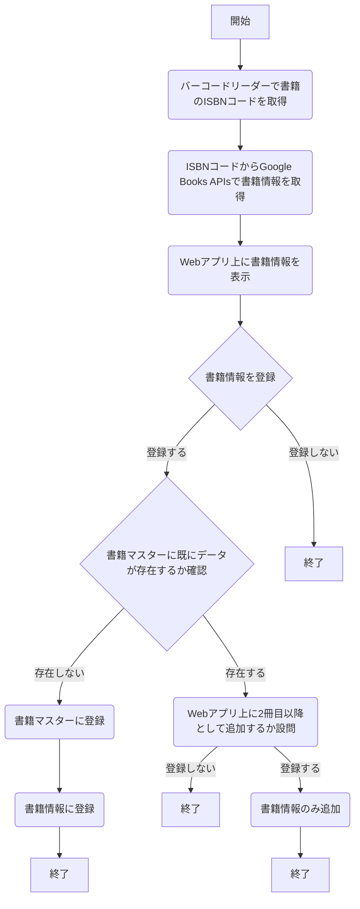

## はじめに
この記事では、社内の有志メンバーで**社内図書館アプリ**を開発しそこで得た体験談をまとめております。

## 背景
なぜ？このPJが発足された理由は、`社員のスキルアップ`と`社内図書館の運用管理コストダウン`

|  ツール名  |  用途  |
| ---- | ---- |
|  Microsoft Teams  |  貸出者同士のコミュニケーションツール  |
|  Microsoft Form  |  借用者からの貸し出し申請フォーム  |
|  Microsoft Outlook  |  貸出者と借用者のコミュニケーションと[クリックポスト](https://clickpost.jp/)の共有  |
|  Google カレンダー  |  貸出書籍の返却管理  |
|  [リブライズ](https://librize.com/ja)  |  書籍情報管理アプリ  |
|  クリックポスト  |  書籍輸送  |

## 結論
:::message
メッセージをここに
:::

## どんなことができるWebアプリ？

## 技術選定
### フロントエンド
|  技術名  |  選定理由  |
| ---- | ---- |
| [TypeScript](https://www.typescriptlang.org/)  |  TD  |
| [Redux](https://redux.js.org/)   |  TD  |
| [Next.js](https://nextjs.org)   |  TD  |

### バックエンド

|  技術名  |  選定理由  |
| ---- | ---- |
| [Python](https://www.python.org/)  |  TD  |
| [Django REST framework](https://www.django-rest-framework.org/)   |  TD  |

### その他

## ページ遷移図

:::details 書籍情報追加フロー

:::

## このWebアプリで力を入れた箇所

### 1. アイコンを活用し視覚的に操作方法をイメージしやく
### 2. 貸出状態がわかりやすいように表示する
`現在 貸出されている書籍はありません`

## テーブル設計
### 書籍マスターテーブル
|  カラム名  |  用途  |
| ---- | ---- |
|  ID  |  TD  |
|  登録日  |  TD  |
|  更新日  |  TD  |
|  書籍タイトル  |  TD  |
|  書籍概要  |  TD  |
|  出版社  |  TD  |
|  発売日  |  TD  |
|  ISBNコード  |  TD  |
|  書影  |  TD  |

### 書籍情報テーブル
|  カラム名  |  用途  |
| ---- | ---- |
|  ID  |  TD  |
|  登録日  |  TD  |
|  更新日  |  TD  |
|  書籍マスターID  |  TD  |

### 貸出管理テーブル

|  カラム名  |  用途  |
| ---- | ---- |
|  ID  |  TD  |
|  登録日  |  TD  |
|  更新日  |  TD  |
|  利用者  |  TD  |
|  貸出対象  |  TD  |
|  貸出日  |  TD  |
|  返却日  |  TD  |
|  返却予定日  |  TD  |
|  貸出状態  |  TD  |
|  手段  |  TD  |

### ユーザーテーブル
|  カラム名  |  用途  |
| ---- | ---- |
|  ID  |  TD  |
|  登録日  |  TD  |
|  更新日  |  TD  |
|  氏名  |  TD  |
|  メールアドレス  |  TD  |
|  住所  |  TD  |
|  郵便番号  |  TD  |

## 今回の学び/反省
