## 🌱 はじめに

今回はこちらの書籍を読みました。
書籍の中で登場する`PlantUML`に触れました。
これまで存在そのものは知っていましたが、深く学習することがなく、スルーしてきました。

しかし、業務でシステム設計を求められることが増え、`クラス図`が欲しくなるケースが増えたので
Geminiに質問しながら、基礎からしっかり学ぼうと思います。

https://book.mynavi.jp/ec/products/detail/id=149226


:::message alert
`PlantUML`は`Java`のインストール等の下準備が必要なため、
今回は下準備が少ない`Mermaid（マーメイド）`を学習します。
:::

## 🌱 Mermaid（マーメイド）とは
:::message
テキスト（コード）を書くだけで、綺麗な図を自動生成してくれるツール

---
▼こんな感じの表現が可能

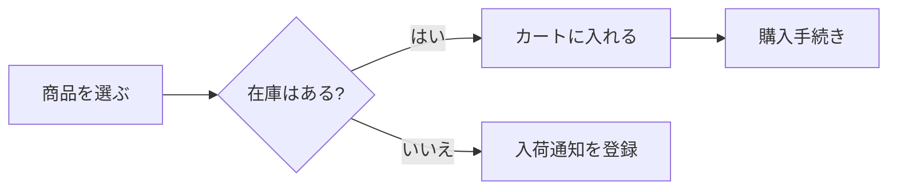
:::

### 具体的に何ができるの？
- **フローチャート**: 業務フローや、プログラムの条件分岐（If文など）の可視化。
- **シーケンス図**: システム間のやり取りや、ユーザーとサーバーの通信の流れ。
- **クラス図**: データの構造や関係性。
- **ガントチャート**: プロジェクトの進捗管理やスケジュール。
- **マインドマップ**: アイデアの整理やブレインストーミング。
- **状態遷移図**: 「注文待ち→支払い済み→発送済み」といった状態の変化。
- **Entity Relationship図 (ER図)**: データベースのテーブル設計。

## 🌱 基礎

:::message
マークダウン形式のファイルに```（バッククォート）に `mermaid`を指定すると、
簡単に `Mermaid`を使えます。
:::

:::message alert
`Mermaid`に従った文法ではない場合、**Syntax error in text**が発生する

---
▼こんな感じのエラーが表示される
```mermaid
XXX
```

:::

## 🌱 サンプル
### フローチャート
`graph TD`を先頭に記載したら、**フローチャート**が表現できます。

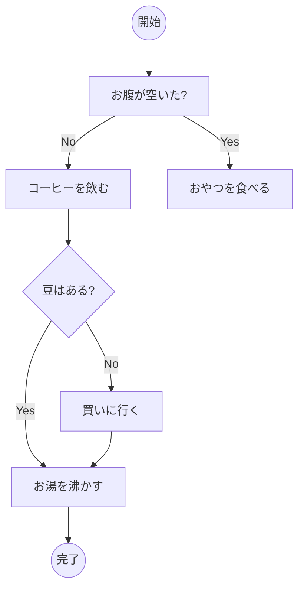

```md
graph TD
    Start((開始)) --> A[お腹が空いた?]
    A -- No --> B[コーヒーを飲む]
    A -- Yes --> C[おやつを食べる]
    B --> D{豆はある?}
    D -- Yes --> E[お湯を沸かす]
    D -- No --> F[買いに行く]
    E --> End((完了))
    F --> E
```

### シーケンス図
`sequenceDiagram`を先頭に記載したら、**シーケンス図**が表現できます。

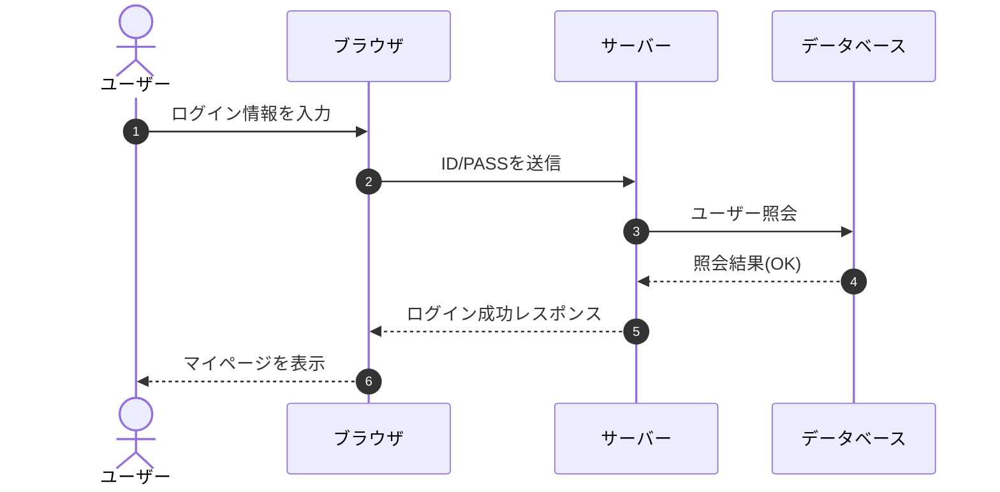

```md
sequenceDiagram
    autonumber
    actor User as ユーザー
    participant Browser as ブラウザ
    participant Server as サーバー
    participant DB as データベース

    User->>Browser: ログイン情報を入力
    Browser->>Server: ID/PASSを送信
    Server->>DB: ユーザー照会
    DB-->>Server: 照会結果(OK)
    Server-->>Browser: ログイン成功レスポンス
    Browser-->>User: マイページを表示
```

### クラス図
`classDiagram`を先頭に記載したら、**クラス図**が表現できます。

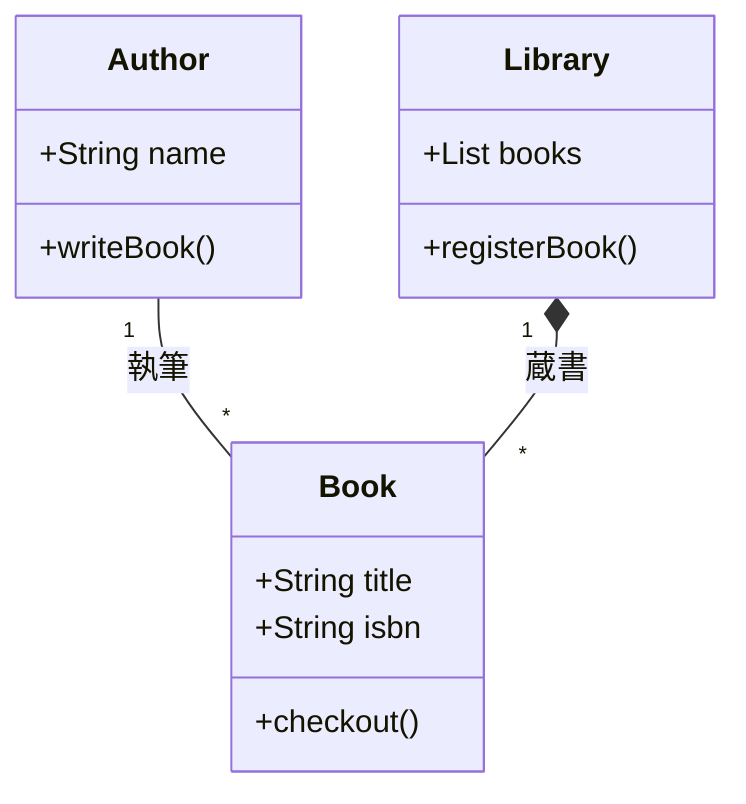

```md
classDiagram
    class Book {
        +String title
        +String isbn
        +checkout()
    }
    class Author {
        +String name
        +writeBook()
    }
    class Library {
        +List books
        +registerBook()
    }

    Author "1" -- "*" Book : 執筆
    Library "1" *-- "*" Book : 蔵書
```

### 状態遷移図
`stateDiagram-v2`を先頭に記載したら、**状態遷移図**が表現できます。

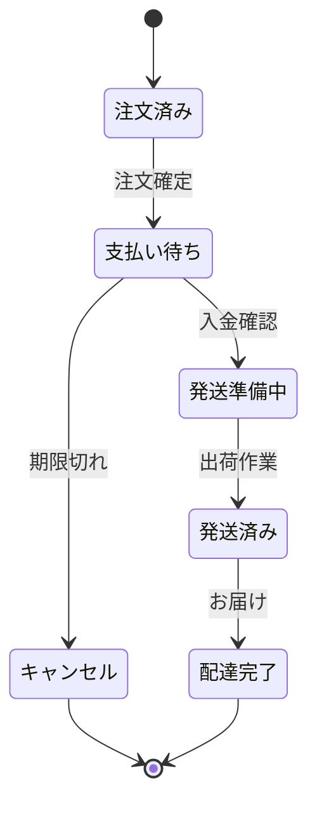

```md
stateDiagram-v2
    [*] --> 注文済み
    注文済み --> 支払い待ち : 注文確定
    支払い待ち --> 発送準備中 : 入金確認
    発送準備中 --> 発送済み : 出荷作業
    発送済み --> 配達完了 : お届け
    支払い待ち --> キャンセル : 期限切れ
    キャンセル --> [*]
    配達完了 --> [*]
```

### Entity Relationship図
`erDiagram`を先頭に記載したら、**Entity Relationship図**が表現できます。

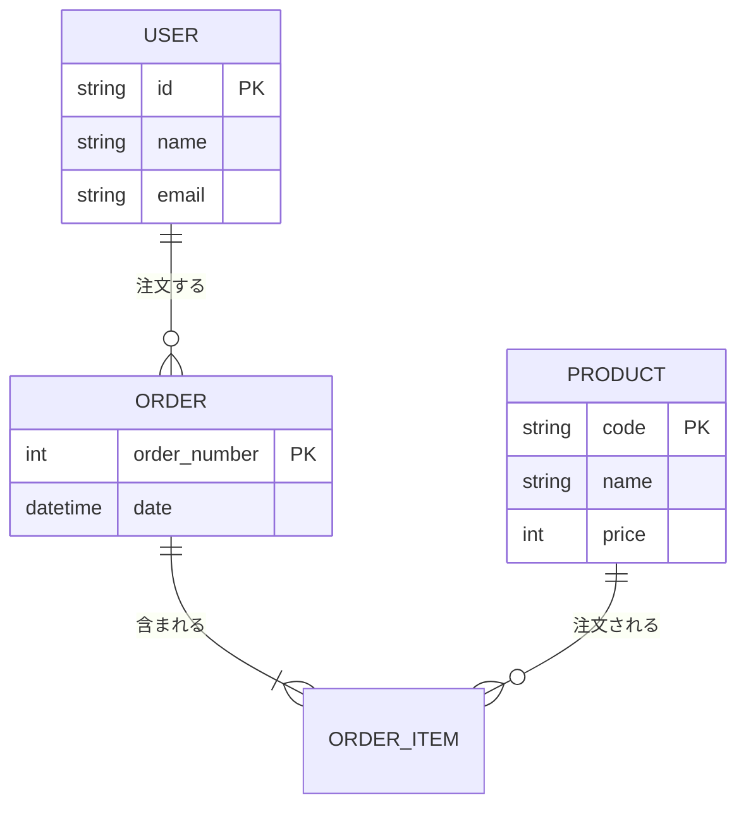

```md
erDiagram
    USER ||--o{ ORDER : "注文する"
    ORDER ||--|{ ORDER_ITEM : "含まれる"
    PRODUCT ||--o{ ORDER_ITEM : "注文される"

    USER {
        string id PK
        string name
        string email
    }
    ORDER {
        int order_number PK
        datetime date
    }
    PRODUCT {
        string code PK
        string name
        int price
    }
```

## 🌱 クラス図を値オブジェクト（Value Object）で意識する

### 1. 宣言
`classDiagram`と書き、クラス図を書くことを宣言します

```diff md:User.md
+ classDiagram
```

---

### 2. クラス名 (Class Name)の定義
`class XXXX {}`を書いてクラスの定義します
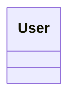
```diff md:User.md
 classDiagram
+    class User {
+   }
```

---

### 3. 属性 (Attribute)の定義
`class XXXX {}`の内側にクラスの属性を記載します。
※ 説明を簡素にしたいので、`UserId`だけにします
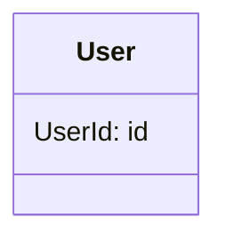
```diff md:User.md
 classDiagram
    class User {
+      UserId: id
   }
```

### 4. 値オブジェクト (Value Object / VO)の定義
クラス名の下に値オブジェクトのクラスを定義します。

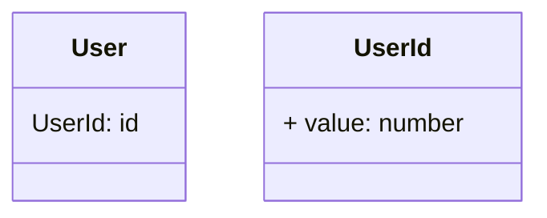

```diff md:User.md
classDiagram
    class User {
      UserId: id
   }

+    class UserId {
+      + value: number
+    }
```


:::message
**可視性記号の一覧**

---

**Private**

- 記述:  `-`
- 説明: そのクラス内のみ
- 用途: 属性（データ）に付ける。直接触らせない。

---

**Public**

- 記述:  `+`
- 説明: どこからでも
- 用途: 操作（メソッド）に付ける。外部への窓口。

---

**Protected**

- 記述:  `#`
- 説明: 子クラスまで
- 用途: 継承を使う場合に稀に使う。

:::


### 5. 関係性(Relationships)の定義
最下段に関係性を定義します。
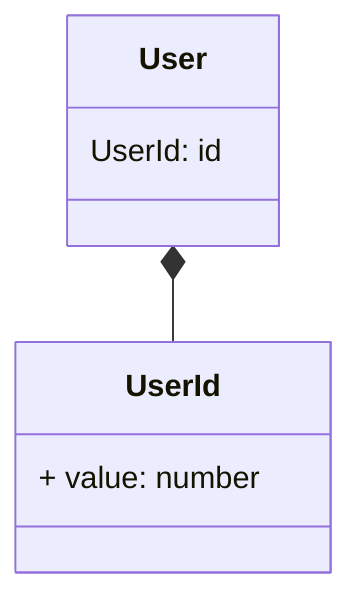

```diff md:User.md
classDiagram
  class User {
    UserId: id
  }

  class UserId {
    + value: number
  }

+  User *-- UserId
```

:::message
**リレーションシップの一覧**

---

**継承 (Inheritance)**

- 記述:  `<|--`
- 説明:「AはBの一種である」
- 用途: 親クラスの性質を引き継ぐ時に使う

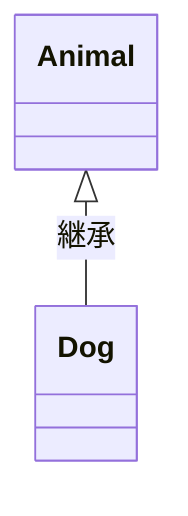

```md
Animal <|-- Dog : 継承
```

---

**コンポジション (Composition)**

- 記述: `*--`
- 説明:「強力な親子関係」
- 用途: 親が消えると子も消える関係性の時に使う

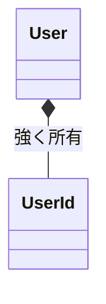

```md
User *-- UserId : 強く所有
```

---

**集約 (Aggregation)**

- 記述: `o--`
- 説明:「弱めの親子関係」
- 用途: 親が消えても、子は独立して存在できる関係性の時に使う

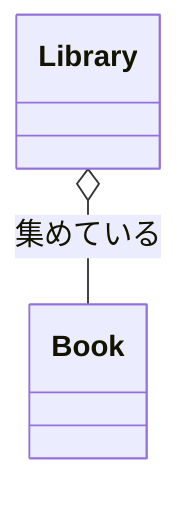

```md
Library o-- Book : 集めている
```

---

**関連 (Association)**

- 記述: `-->` or `--`
- 説明:「AがBを知っている・利用している」
- 用途: 親が消えても、子は独立して存在できる関係性の時に使う

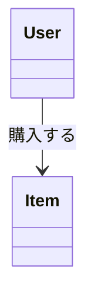

```md
User --> Item : 購入する
```

---

**多重度**

- 記述: `"n"`
- 説明:「1対1」や「1対多」
- 用途: 多重度関係性の時に使う

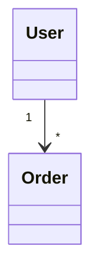

```md
User "1" --> "*" Order
```

:::

### 6. コメント補足
`note for XXXX: コメント`でその値についての値オブジェクトの**制約**や**条件**を補足する

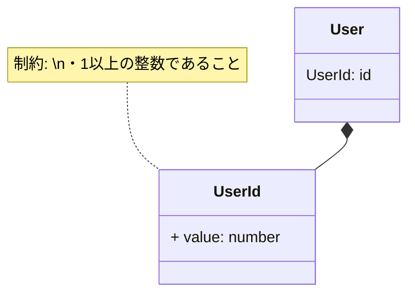

```diff md:User.md
classDiagram
  class User {
    UserId: id
  }

+  note for UserId "制約: \n・1以上の整数であること"

  class UserId {
    + value: number
  }

  User *-- UserId
```

### 7. おまけ(クラス図を左から右へ)
`direction LR`を指定するとクラス図を左から右へに変更できます。
※ デフォルトは、`direction TD`: 上から下へ

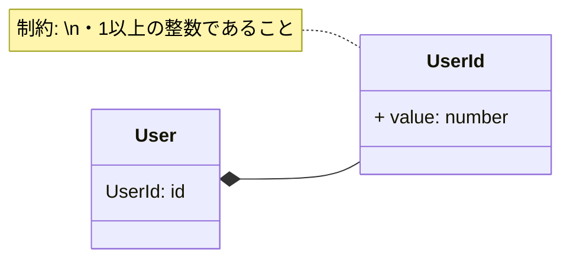

```diff md:User.md
classDiagram
+  direction LR
  class User {
    UserId: id
  }

  note for UserId "制約: \n・1以上の整数であること"

  class UserId {
    + value: number
  }

  User *-- UserId
```
