## 🌱 はじめに

今回は、山下祐也 著『つくりながら学ぶ！ ドメイン駆動設計 実践入門』（マイナビ出版）を読みました。

https://book.mynavi.jp/ec/products/detail/id=149226

書籍の中に`PlantUML`が登場しました。
これまで存在そのものは知っていましたが、深く学習することがなく、スルーしてきました。

しかし、業務でシステム設計を任される機会が増え、`クラス図`が欲しい場面も多くなったので、Geminiに質問しながら基礎からしっかり学ぼうと思います。


:::message alert
`PlantUML`をローカルで使うには`Java`のインストールなどの下準備が必要なため（オンラインサーバーを使う場合は不要）、
今回は下準備が少なく、Zenn や GitHub でそのまま表示できる`Mermaid（マーメイド）`を学習します。
:::

## 🌱 Mermaid（マーメイド）とは
:::message
テキスト（コード）を書くだけで、綺麗な図を自動生成してくれるツール

---
▼こんな感じの表現が可能

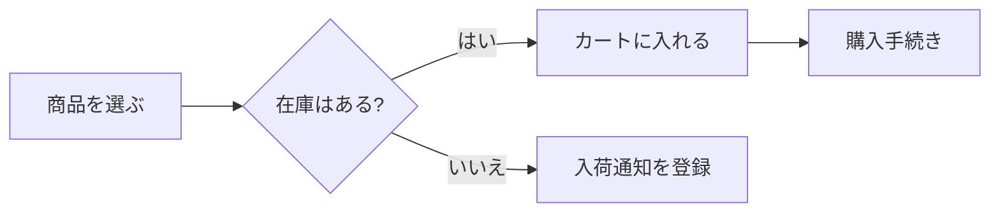
```mermaid
flowchart LR
    A[商品を選ぶ] --> B{在庫はある?}
    B -- はい --> C[カートに入れる]
    B -- いいえ --> D[入荷通知を登録]
    C --> E[購入手続き]
```
:::

### 具体的に何ができるの？
- **フローチャート**: 業務フローや、プログラムの条件分岐（If文など）の可視化。
- **シーケンス図**: システム間のやり取りや、ユーザーとサーバーの通信の流れ。
- **クラス図**: データの構造や関係性。
- **ガントチャート**: プロジェクトの進捗管理やスケジュール。
- **マインドマップ**: アイデアの整理やブレインストーミング。
- **状態遷移図**: 「注文待ち→支払い済み→発送済み」といった状態の変化。
- **Entity Relationship図 (ER図)**: データベースのテーブル設計。

## 🌱 基礎

:::message
Zenn や GitHub など Mermaid に対応した環境では、Markdown のコードブロックの言語に`mermaid`を指定すると、簡単に`Mermaid`を使えます。
:::

:::message alert
`Mermaid`の文法に従っていない場合、**Syntax error in text**などのエラーが発生します。

---
▼こんな感じのエラーが表示される
```mermaid
XXX
```

:::

## 🌱 サンプル
### フローチャート
`graph TD`を先頭に記載すると、**フローチャート**を表現できます。
（`graph`の代わりに`flowchart`とも書けます。`TD`は上から下、`LR`は左から右の向きを表します）

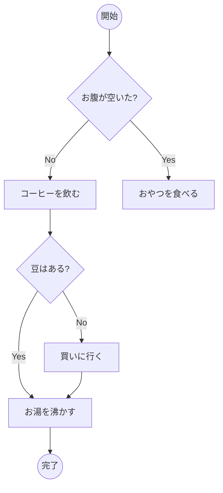
```mermaid
graph TD
    Start((開始)) --> A{お腹が空いた?}
    A -- No --> B[コーヒーを飲む]
    A -- Yes --> C[おやつを食べる]
    B --> D{豆はある?}
    D -- Yes --> E[お湯を沸かす]
    D -- No --> F[買いに行く]
    E --> End((完了))
    F --> E
```

```md
graph TD
    Start((開始)) --> A{お腹が空いた?}
    A -- No --> B[コーヒーを飲む]
    A -- Yes --> C[おやつを食べる]
    B --> D{豆はある?}
    D -- Yes --> E[お湯を沸かす]
    D -- No --> F[買いに行く]
    E --> End((完了))
    F --> E
```

### シーケンス図
`sequenceDiagram`を先頭に記載したら、**シーケンス図**が表現できます。

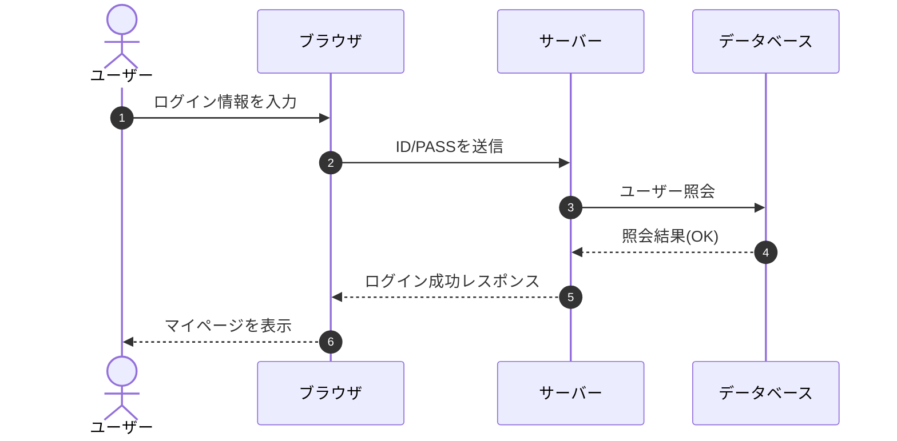
```mermaid
sequenceDiagram
    autonumber
    actor User as ユーザー
    participant Browser as ブラウザ
    participant Server as サーバー
    participant DB as データベース

    User->>Browser: ログイン情報を入力
    Browser->>Server: ID/PASSを送信
    Server->>DB: ユーザー照会
    DB-->>Server: 照会結果(OK)
    Server-->>Browser: ログイン成功レスポンス
    Browser-->>User: マイページを表示
```

```md
sequenceDiagram
    autonumber
    actor User as ユーザー
    participant Browser as ブラウザ
    participant Server as サーバー
    participant DB as データベース

    User->>Browser: ログイン情報を入力
    Browser->>Server: ID/PASSを送信
    Server->>DB: ユーザー照会
    DB-->>Server: 照会結果(OK)
    Server-->>Browser: ログイン成功レスポンス
    Browser-->>User: マイページを表示
```

### クラス図
`classDiagram`を先頭に記載したら、**クラス図**が表現できます。

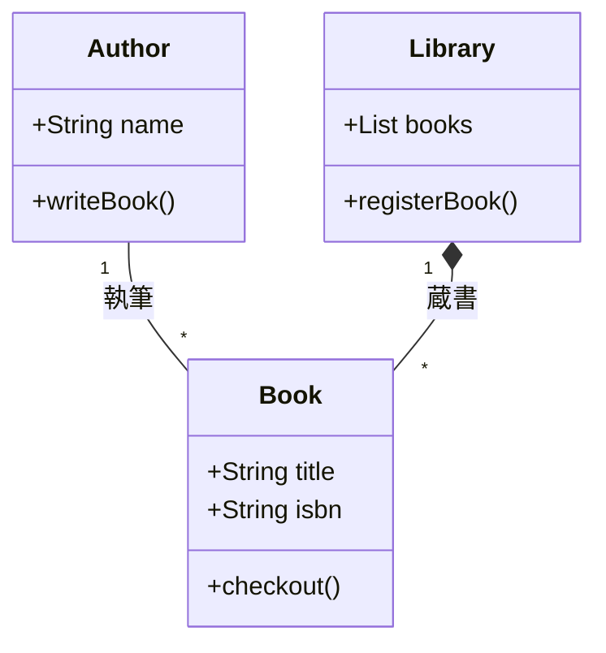
```mermaid
classDiagram
    class Book {
        +String title
        +String isbn
        +checkout()
    }
    class Author {
        +String name
        +writeBook()
    }
    class Library {
        +List books
        +registerBook()
    }

    Author "1" -- "*" Book : 執筆
    Library "1" *-- "*" Book : 蔵書
```

```md
classDiagram
    class Book {
        +String title
        +String isbn
        +checkout()
    }
    class Author {
        +String name
        +writeBook()
    }
    class Library {
        +List books
        +registerBook()
    }

    Author "1" -- "*" Book : 執筆
    Library "1" *-- "*" Book : 蔵書
```

### 状態遷移図
`stateDiagram-v2`を先頭に記載したら、**状態遷移図**が表現できます。

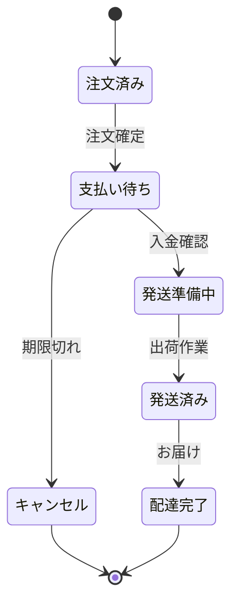
```mermaid
stateDiagram-v2
    [*] --> 注文済み
    注文済み --> 支払い待ち : 注文確定
    支払い待ち --> 発送準備中 : 入金確認
    発送準備中 --> 発送済み : 出荷作業
    発送済み --> 配達完了 : お届け
    支払い待ち --> キャンセル : 期限切れ
    キャンセル --> [*]
    配達完了 --> [*]
```

```md
stateDiagram-v2
    [*] --> 注文済み
    注文済み --> 支払い待ち : 注文確定
    支払い待ち --> 発送準備中 : 入金確認
    発送準備中 --> 発送済み : 出荷作業
    発送済み --> 配達完了 : お届け
    支払い待ち --> キャンセル : 期限切れ
    キャンセル --> [*]
    配達完了 --> [*]
```

### Entity Relationship図
`erDiagram`を先頭に記載したら、**Entity Relationship図**が表現できます。

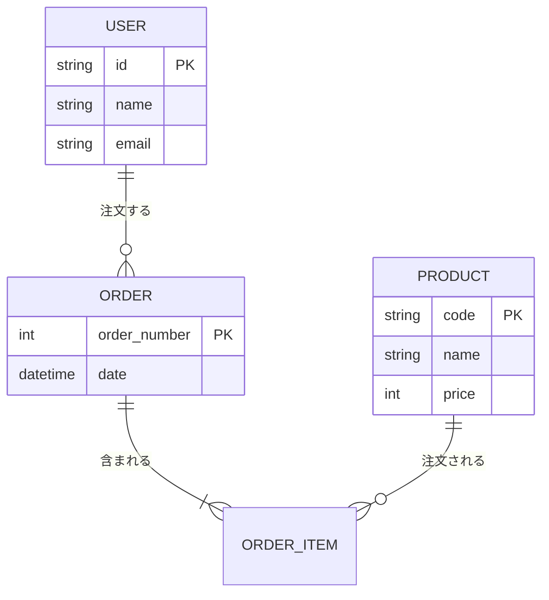
```mermaid
erDiagram
    USER ||--o{ ORDER : "注文する"
    ORDER ||--|{ ORDER_ITEM : "含まれる"
    PRODUCT ||--o{ ORDER_ITEM : "注文される"

    USER {
        string id PK
        string name
        string email
    }
    ORDER {
        int order_number PK
        datetime date
    }
    PRODUCT {
        string code PK
        string name
        int price
    }
```

```md
erDiagram
    USER ||--o{ ORDER : "注文する"
    ORDER ||--|{ ORDER_ITEM : "含まれる"
    PRODUCT ||--o{ ORDER_ITEM : "注文される"

    USER {
        string id PK
        string name
        string email
    }
    ORDER {
        int order_number PK
        datetime date
    }
    PRODUCT {
        string code PK
        string name
        int price
    }
```

## 🌱 値オブジェクトを意識してクラス図を書く

### 1. 宣言
`classDiagram`と書き、クラス図を書くことを宣言します。

```diff md:User.md
+ classDiagram
```

---

### 2. クラス名の定義
`class XXXX {}`を書いてクラスを定義します。
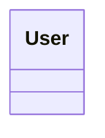
```mermaid
classDiagram
   class User {
   }
```
```diff md:User.md
 classDiagram
+    class User {
+   }
```

---

### 3. 属性の定義
`class XXXX {}`の内側にクラスの属性を記載します。
※ 説明を簡素にしたいので、`UserId`だけにします
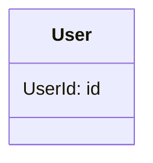
```mermaid
classDiagram
   class User {
    UserId: id
   }
```
```diff md:User.md
 classDiagram
    class User {
+      UserId: id
   }
```

### 4. 値オブジェクトの定義
`User`クラスの定義の下に、値オブジェクト`UserId`のクラスを定義します。

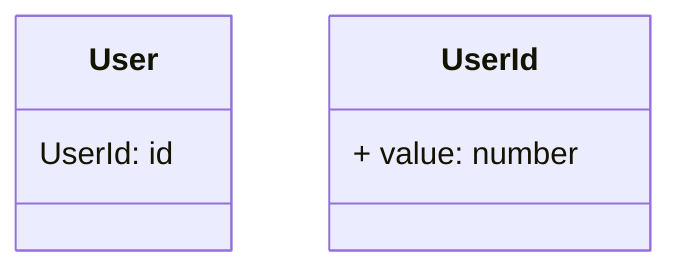
```mermaid
classDiagram
  class User {
    UserId: id
   }

  class UserId {
    + value: number
  }
```

```diff md:User.md
classDiagram
    class User {
      UserId: id
   }

+    class UserId {
+      + value: number
+    }
```


:::message
**主な可視性記号**（用途は一般的な指針です）

---

**Private**

- 記述:  `-`
- 説明: そのクラス内のみ
- 用途: 属性（データ）に付ける。直接触らせない。

---

**Public**

- 記述:  `+`
- 説明: どこからでも
- 用途: 操作（メソッド）に付ける。外部への窓口。

---

**Protected**

- 記述:  `#`
- 説明: 子クラスまで
- 用途: 継承を使う場合に、まれに付ける。

---

**Package/Internal**

- 記述: `~`
- 説明: 同じパッケージ内のみ

:::


### 5. 関係性の定義
最下段に関係性を定義します。
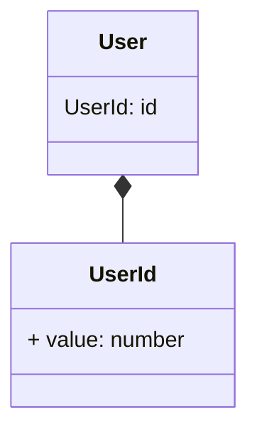
```mermaid
classDiagram
  class User {
    UserId: id
  }

  class UserId {
    + value: number
  }

  User *-- UserId
```

```diff md:User.md
classDiagram
  class User {
    UserId: id
  }

  class UserId {
    + value: number
  }

+  User *-- UserId
```

:::message
**リレーションシップの一覧**

---

**継承 (Inheritance)**

- 記述:  `<|--`
- 説明:「`親 <|-- 子`の形で書き、子は親の一種である」（例: Dog は Animal の一種）
- 用途: 親クラスの性質を引き継ぐ時に使う

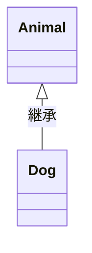
```mermaid
classDiagram
  Animal <|-- Dog : 継承
```

```md
Animal <|-- Dog : 継承
```

---

**コンポジション (Composition)**

- 記述: `*--`
- 説明:「強力な親子関係」
- 用途: 親が消えると子も消える関係性の時に使う

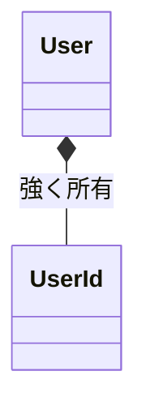
```mermaid
classDiagram
  User *-- UserId : 強く所有
```

```md
User *-- UserId : 強く所有
```

---

**集約 (Aggregation)**

- 記述: `o--`
- 説明:「弱めの親子関係」
- 用途: 親が消えても、子は独立して存在できる関係性の時に使う

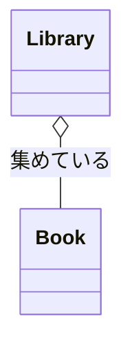
```mermaid
classDiagram
  Library o-- Book : 集めている
```

```md
Library o-- Book : 集めている
```

---

**関連 (Association)**

- 記述: `-->`（`--` は向きのない実線のリンク）
- 説明:「AがBを知っている・利用している」
- 用途: あるクラスが別のクラスを参照・利用している（所有はしない）関係の時に使う

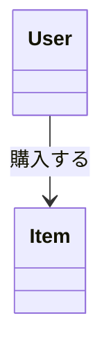
```mermaid
classDiagram
  User --> Item : 購入する
```

```md
User --> Item : 購入する
```

---

**多重度**

- 記述: `"n"`
- 説明:「1対1」や「1対多」
- 用途: クラス同士が何対何で対応するかを示す時に使う

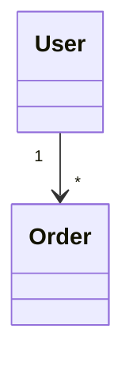
```mermaid
classDiagram
  User "1" --> "*" Order
```

```md
User "1" --> "*" Order
```

:::

### 6. コメント補足
`note for XXXX "コメント"`で、値オブジェクトの**制約**や**条件**を補足します。

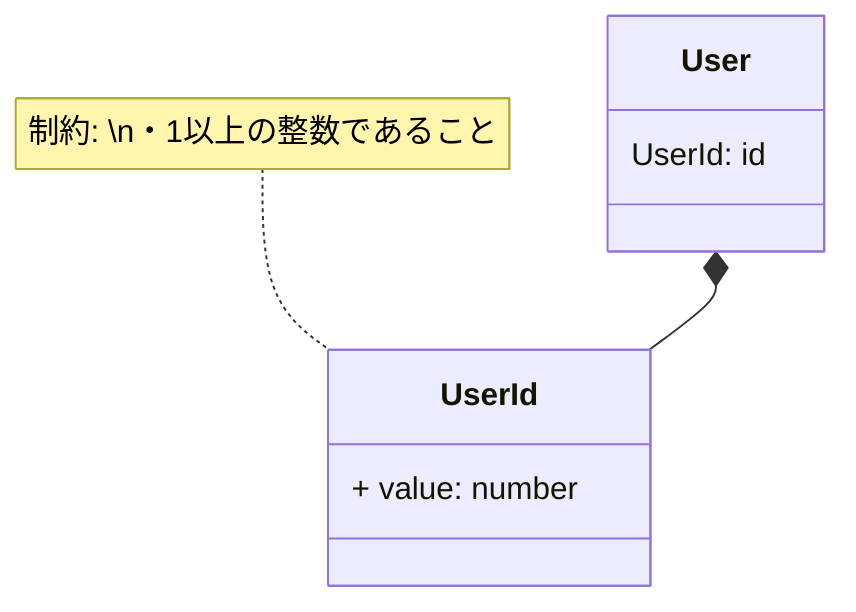
```mermaid
classDiagram
  class User {
    UserId: id
  }

  note for UserId "制約: \n・1以上の整数であること"

  class UserId {
    + value: number
  }

  User *-- UserId
```

```diff md:User.md
classDiagram
  class User {
    UserId: id
  }

+  note for UserId "制約: \n・1以上の整数であること"

  class UserId {
    + value: number
  }

  User *-- UserId
```

### 7. おまけ（値オブジェクトのグループ分け）
`namespace XXXX {}`でグループ分けをします（Mermaid の比較的新しいバージョンで使える機能です）。

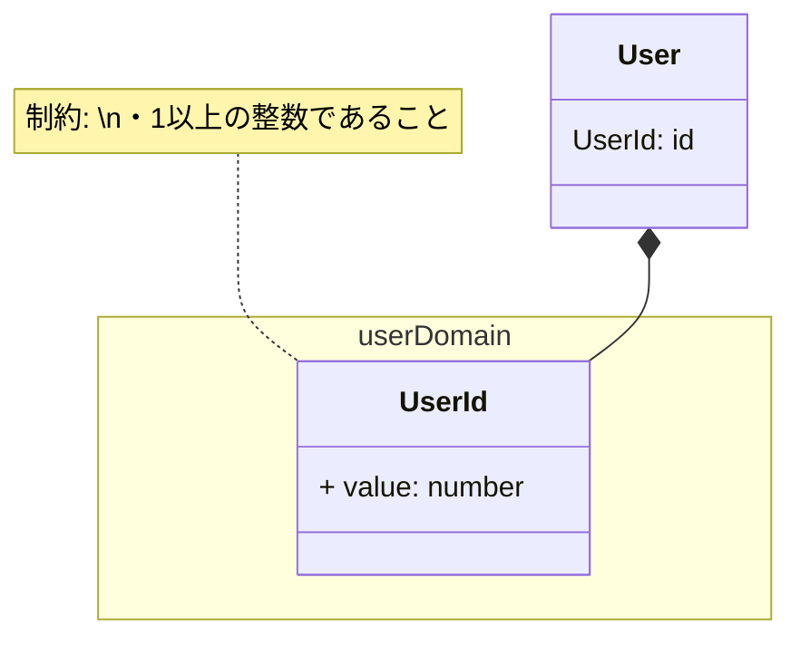
```mermaid
classDiagram
  class User {
    UserId: id
  }

  note for UserId "制約: \n・1以上の整数であること"

  namespace userDomain {
    class UserId {
      + value: number
    }
  }

  User *-- UserId
```

```diff md:User.md
classDiagram
  class User {
    UserId: id
  }

  note for UserId "制約: \n・1以上の整数であること"

+  namespace userDomain {
    class UserId {
      + value: number
    }
+  }

  User *-- UserId
```

### 8. おまけ（クラス図を左から右へ）
`direction LR`を指定すると、クラス図の向きを左から右へ変更できます。
※ デフォルトは`direction TB`（上から下へ）です。

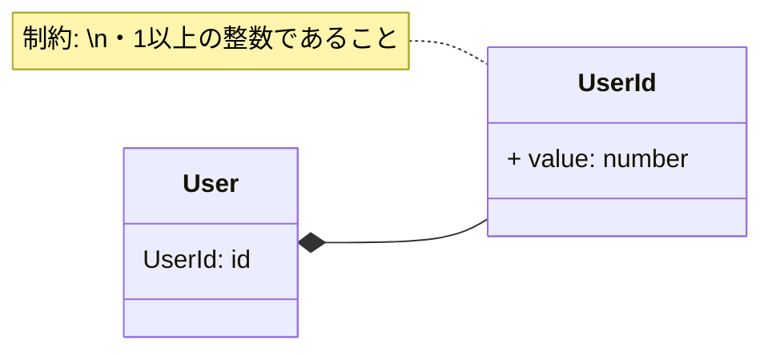
```mermaid
classDiagram
  direction LR
  class User {
    UserId: id
  }

  note for UserId "制約: \n・1以上の整数であること"

  class UserId {
    + value: number
  }

  User *-- UserId
```

```diff md:User.md
classDiagram
+  direction LR
  class User {
    UserId: id
  }

  note for UserId "制約: \n・1以上の整数であること"

  class UserId {
    + value: number
  }

  User *-- UserId
```
