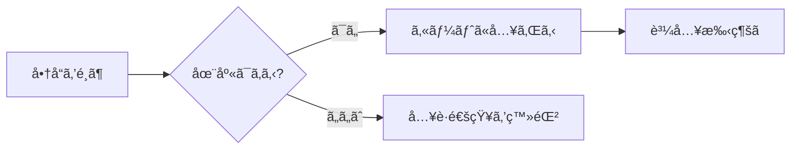
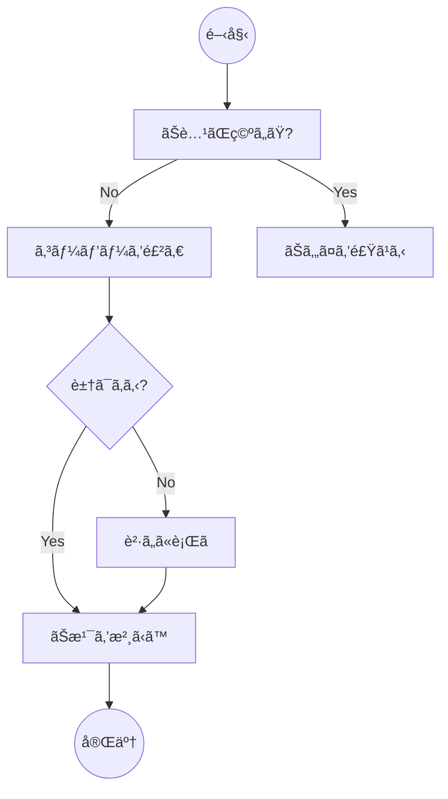
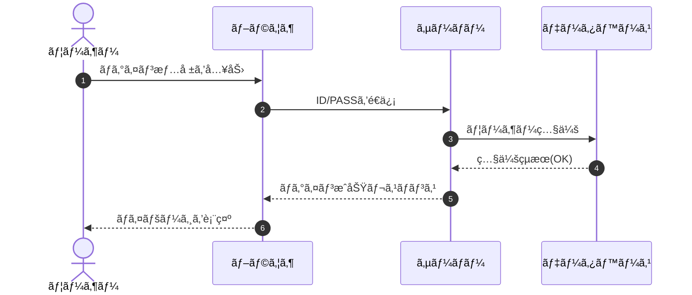
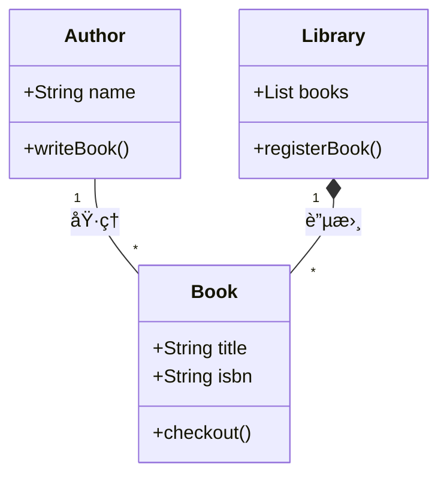
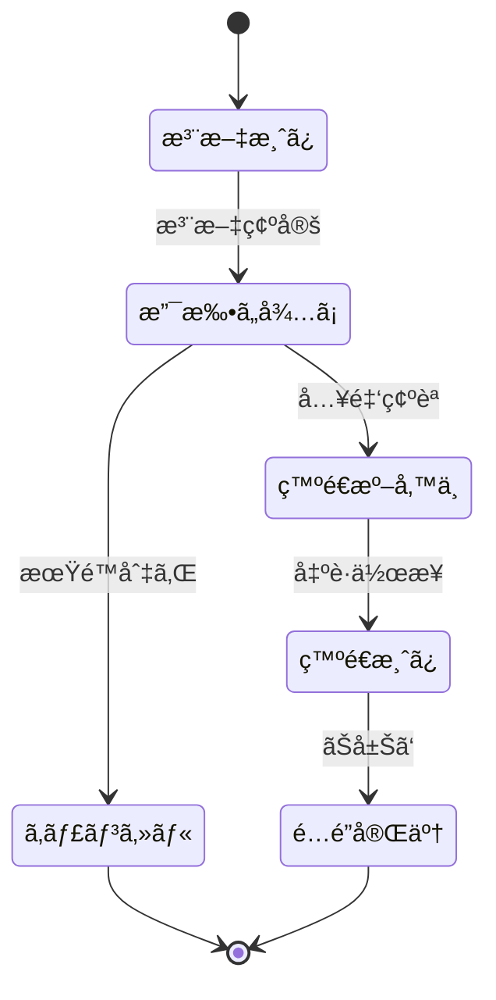
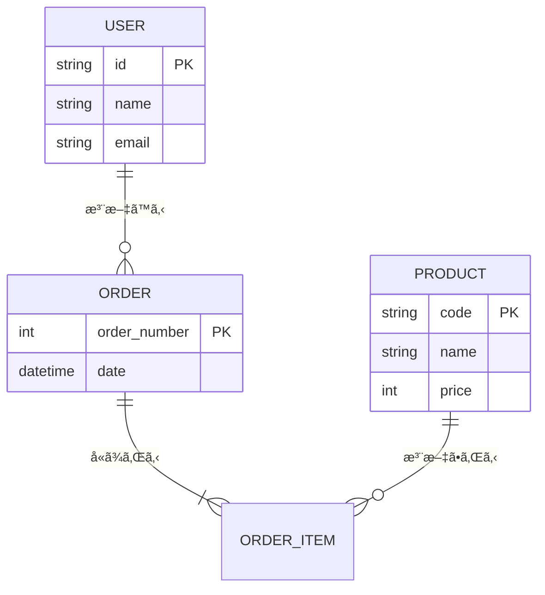

## 🌱 ã¯ã˜ã‚ã«

今å›ã¯ã“ã¡ã‚‰ã®æ›¸ç±ã‚’読ã¿ã¾ã—ãŸã€‚
書ç±ã®ä¸­ã§ç™»å ´ã™ã‚‹`PlantUML`ã«è§¦ã‚Œã¾ã—ãŸã€‚
ã“ã‚Œã¾ã§å­˜åœ¨ãã®ã‚‚ã®ã¯çŸ¥ã£ã¦ã„ã¾ã—ãŸãŒã€æ·±ã学習ã™ã‚‹ã“ã¨ãŒãªãã€ã‚¹ãƒ«ãƒ¼ã—ã¦ãã¾ã—ãŸã€‚
ã—ã‹ã—ã€æ¥­å‹™ã§ã‚·ã‚¹ãƒ†ãƒ è¨­è¨ˆã‚’求ã‚られるã“ã¨ãŒå¢—ãˆã€`クラス図`ãŒæ¬²ã—ããªã‚‹ã‚±ãƒ¼ã‚¹ãŒå¢—ãˆãŸã®ã§
Geminiã«è³ªå•ã—ãªãŒã‚‰ã€åŸºç¤ã‹ã‚‰ã—ã£ã‹ã‚Šå­¦ã¼ã†ã¨æ€ã„ã¾ã™ã€‚

https://book.mynavi.jp/ec/products/detail/id=149226


:::message alert
`PlantUM`ã¯`Java`ã®ã‚¤ãƒ³ã‚¹ãƒˆãƒ¼ãƒ«ç­‰ã®ä¸‹æº–å‚™ãŒå¿…è¦ãªãŸã‚ã€
今å›ã¯ä¸‹æº–å‚™ãŒå°‘ãªã„`Mermaid（ãƒãƒ¼ãƒ¡ã‚¤ãƒ‰ï¼‰`を学習ã—ã¾ã™ã€‚
:::

## 🌱 Mermaid（ãƒãƒ¼ãƒ¡ã‚¤ãƒ‰ï¼‰ã¨ã¯
:::message
テキスト（コード）を書ãã ã‘ã§ã€ç¶ºéº—ãªå›³ã‚’自動生æˆã—ã¦ãれるツール
---
â–¼ã“ã‚“ãªæ„Ÿã˜ã®è¡¨ç¾ãŒå¯èƒ½


```mermaid
graph LR
    A[商å“ã‚’é¸ã¶] --> B{在庫ã¯ã‚ã‚‹?}
    B -- ã¯ã„ --> C[カートã«å…¥ã‚Œã‚‹]
    B -- ã„ã„㈠--> D[å…¥è·é€šçŸ¥ã‚’登録]
    C --> E[購入手続ã]
```
:::

### 具体的ã«ä½•ãŒã§ãã‚‹ã®ï¼Ÿ
- フローãƒãƒ£ãƒ¼ãƒˆ: 業務フローやã€ãƒ—ログラムã®æ¡ä»¶åˆ†å²ï¼ˆIfæ–‡ãªã©ï¼‰ã®å¯è¦–化。
- シーケンス図: システム間ã®ã‚„ã‚Šå–ã‚Šã‚„ã€ãƒ¦ãƒ¼ã‚¶ãƒ¼ã¨ã‚µãƒ¼ãƒãƒ¼ã®é€šä¿¡ã®æµã‚Œã€‚
- クラス図: データã®æ§‹é€ ã‚„関係性。
- ガントãƒãƒ£ãƒ¼ãƒˆ: プロジェクトã®é€²æ—管ç†ã‚„スケジュール。
- ãƒã‚¤ãƒ³ãƒ‰ãƒãƒƒãƒ—: アイデアã®æ•´ç†ã‚„ブレインストーミング。
- 状態é·ç§»å›³: 「注文待ã¡â†’支払ã„済ã¿â†’発é€æ¸ˆã¿ã€ã¨ã„ã£ãŸçŠ¶æ…‹ã®å¤‰åŒ–。
- Entity Relationship図 (ER図): データベースã®ãƒ†ãƒ¼ãƒ–ル設計。

## 🌱 基ç¤

:::message
ãƒãƒ¼ã‚¯ãƒ€ã‚¦ãƒ³å½¢å¼ã®ãƒ•ã‚¡ã‚¤ãƒ«ã«```（ãƒãƒƒã‚¯ã‚¯ã‚©ãƒ¼ãƒˆï¼‰ã« `mermaid`を指定ã™ã‚‹ã¨ã€
ç°¡å˜ã« `Mermaid`を使ãˆã¾ã™ã€‚
:::

:::message alert
`Mermaid`ã«å¾“ã£ãŸæ–‡æ³•ã§ã¯ãªã„å ´åˆã€**Syntax error in text**ãŒç™ºç”Ÿã™ã‚‹

---
â–¼ã“ã‚“ãªæ„Ÿã˜ã®ã‚¨ãƒ©ãƒ¼ãŒè¡¨ç¤ºã•ã‚Œã‚‹
```mermaid
XXX
```

:::

## 🌱 フローãƒãƒ£ãƒ¼ãƒˆ
`graph TD`を先頭ã«è¨˜è¼‰ã—ãŸã‚‰ã€**フローãƒãƒ£ãƒ¼ãƒˆ**ãŒè¡¨ç¾ã™ã‚‹ã“ã¨ã§ãã¾ã™ã€‚


```mermaid
graph TD
    Start((開始)) --> A[ãŠè…¹ãŒç©ºã„ãŸ?]
    A -- No --> B[コーヒーを飲む]
    A -- Yes --> C[ãŠã‚„ã¤ã‚’食ã¹ã‚‹]
    B --> D{豆ã¯ã‚ã‚‹?}
    D -- Yes --> E[ãŠæ¹¯ã‚’沸ã‹ã™]
    D -- No --> F[è²·ã„ã«è¡Œã]
    E --> End((完了))
    F --> E
```

## 🌱 シーケンス図
`sequenceDiagram`を先頭ã«è¨˜è¼‰ã—ãŸã‚‰ã€**シーケンス図**ãŒè¡¨ç¾ã™ã‚‹ã“ã¨ã§ãã¾ã™ã€‚


```mermaid
sequenceDiagram
    autonumber
    actor User as ユーザー
    participant Browser as ブラウザ
    participant Server as サーãƒãƒ¼
    participant DB as データベース

    User->>Browser: ログイン情報を入力
    Browser->>Server: ID/PASSã‚’é€ä¿¡
    Server->>DB: ユーザー照会
    DB-->>Server: 照会çµæœ(OK)
    Server-->>Browser: ログインæˆåŠŸãƒ¬ã‚¹ãƒãƒ³ã‚¹
    Browser-->>User: ãƒã‚¤ãƒšãƒ¼ã‚¸ã‚’表示
```

## 🌱 クラス図
`classDiagram`を先頭ã«è¨˜è¼‰ã—ãŸã‚‰ã€**クラス図**ãŒè¡¨ç¾ã™ã‚‹ã“ã¨ã§ãã¾ã™ã€‚


```mermaid
classDiagram
    class Book {
        +String title
        +String isbn
        +checkout()
    }
    class Author {
        +String name
        +writeBook()
    }
    class Library {
        +List books
        +registerBook()
    }

    Author "1" -- "*" Book : 執筆
    Library "1" *-- "*" Book : 蔵書
```

## 🌱 状態é·ç§»å›³
`stateDiagram-v2`を先頭ã«è¨˜è¼‰ã—ãŸã‚‰ã€**状態é·ç§»å›³**ãŒè¡¨ç¾ã™ã‚‹ã“ã¨ã§ãã¾ã™ã€‚


```mermaid
stateDiagram-v2
    [*] --> 注文済ã¿
    注文済㿠--> 支払ã„å¾…ã¡ : 注文確定
    支払ã„å¾…ã¡ --> 発é€æº–備中 : 入金確èª
    発é€æº–備中 --> 発é€æ¸ˆã¿ : 出è·ä½œæ¥­
    発é€æ¸ˆã¿ --> é…é”完了 : ãŠå±Šã‘
    支払ã„å¾…ã¡ --> キャンセル : 期é™åˆ‡ã‚Œ
    キャンセル --> [*]
    é…é”完了 --> [*]
```
## 🌱 Entity Relationship図
`erDiagram`を先頭ã«è¨˜è¼‰ã—ãŸã‚‰ã€**Entity Relationship図**ãŒè¡¨ç¾ã™ã‚‹ã“ã¨ã§ãã¾ã™ã€‚


```mermaid
erDiagram
    USER ||--o{ ORDER : "注文ã™ã‚‹"
    ORDER ||--|{ ORDER_ITEM : "å«ã¾ã‚Œã‚‹"
    PRODUCT ||--o{ ORDER_ITEM : "注文ã•ã‚Œã‚‹"

    USER {
        string id PK
        string name
        string email
    }
    ORDER {
        int order_number PK
        datetime date
    }
    PRODUCT {
        string code PK
        string name
        int price
    }
```
