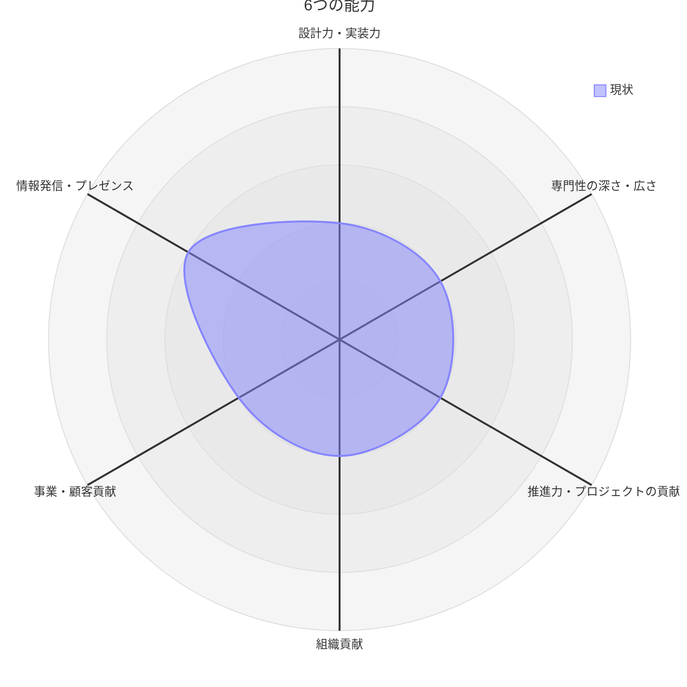

## 🌱 はじめに

2025年にAnthropicが開発したAIコーディングエージェント`Claude Code`が登場し、エンジニアの働き方が大きく変わりました。
AIにはコーディング技術や知識では敵わなくなり、
簡単なタスクなら自然言語でお願いするだけで完了することが増えました。

自然言語で日々の業務が済むようになり、少し物足りなさを感じつつ、
今後のキャリアについて少し心配になり、赤川朗『ITエンジニアの転職学 2万人の選択から見えた、後悔しないキャリア戦略』（講談社、2025年）を読みました。

転職するつもりはないですが、キャリアを見直すのに役立つと評判が良いと聞いたので
一読してみました。

https://www.kodansha.co.jp/book/products/0000419328

## 🌱 本書で学んだ内容(抜粋)

1. 30代〜60代の最高年収の分布
   - 上位10%: 1200万円
   - 上位25%: 900万円
   - 中央値: 700万円
2. 受託開発（クライアントから依頼されて開発）< 自社開発（自社プロダクトを自分たちで開発）の方が高収入
3. 社内の昇進を待つより、転職した方が年収は上がりやすい
4. 2025年の求人数が多い領域
   1. アプリケーションエンジニア: 約25%
   2. バックエンドエンジニア: 約20%
   3. フロントエンドエンジニア: 約5%
5. 2025年の求人数が多い言語
   1. TypeScript: 約25%
   2. Python: 約15%
   3. JavaScript: 約10%

## 🌱 結論

:::message
**私は下記項目を重視します。**

1. 流行りツールより基礎技術の学習を優先する
2. スペシャリストより領域の網羅性を重視する
3. エンジニアに必要な6つの能力で、まずオール3を目指す
4. 自分の「武器」を作る

:::

## 🌱 私の簡単なプロフィール

- 年齢：30代
- 学歴：生物系大学卒（遺伝子/タンパク質）
- 前職：医薬品・医療機器等安全性情報業務（4年間）
- 現職：アプリケーションエンジニア（フロントエンドになりたいけどなれない）
- 言語：Python, TypeScript
- 保有資格：
  - 2025/05: 情報セキュリティマネジメント試験
  - 2025/12: 基本情報技術者試験

## 🌱 1. 流行りツールより基礎技術の学習を優先する

:::message
本書のP45に下記のメッセージがありました。

> 「コンピューターサイエンスの原理を押さえた方が応用範囲が広がった」
:::

基礎を知らなくてもアプリ開発はできますし、AIがあれば尚更だと感じます。
しかし、基礎を知ったうえでの開発ではアプリ品質に大きな差が出ると考えています。
「使いやすい」「不具合が少ない」「安定している」などの細かい差は、基礎の有無に依存すると思います。

簡単な経歴の通りで、私はコンピューターサイエンスを大学で学んでいません。

本書では下記内容の学習を推奨していました。

- 大学のコンピューターサイエンス
- ネットワーク
- OS
- アルゴリズム
- IPAの論文（筆者注: 情報処理推進機構（IPA）の高度試験の一部で出題される論文問題）

自分なりに基礎を学べる書籍を整理しましたので、共有します。

### 大学のコンピューターサイエンス

ハーバード大学のコンピューターサイエンス講座「CS50」を、有志が日本語に翻訳した無料の講座です（非公式）。

https://cs50.jp/

### ネットワーク

超有名な本ですが、まだ読んでなかったです...

https://www.ohmsha.co.jp/book/9784274224478/

### OS

Linuxの内部動作を「試して学ぶ」実践的アプローチで解説する点が特徴だそうです。

https://gihyo.jp/book/2022/978-4-297-13148-7

### アルゴリズム

超有名な本ですが、まだ読んでなかったです...

https://www.kodansha.co.jp/book/products/0000275430

### Web [おまけ]

Webアプリケーションエンジニアなら一読しておきたいです。

https://gihyo.jp/book/2024/978-4-297-14571-2

## 🌱 2. スペシャリストより領域の網羅性を重視する

:::message
本書のP45に下記のメッセージがありました。

> 「スペシャリスト一本では頭打ちになると感じる。隣接領域への挑戦を続けた」
:::

技術の移り変わりが速い背景もあると思いますが、
リスクヘッジの観点から可能なら分散したほうが得策に感じます。

自分もフロントエンドだけではなく、
バックエンドやインフラを完璧ではないがある程度はわかるレベル感まで達し
隣接領域の強化を目指したいと思います。

## 🌱 3. エンジニアに必要な6つの能力で、まずオール3を目指す

詳細は、本書で確認していただきたいですが、簡単に書きます。

### 必要な6つの能力とは？

1. 設計力・実装力
2. 専門性の深さ・広さ
3. 推進力・プロジェクトの貢献
4. 組織貢献
5. 事業・顧客貢献
6. 情報発信・プレゼンス

### 能力のレベルとは？

1. 周囲の支援が必要なレベル
2. 自立（サポートがあれば業務遂行できる）
3. 主力（社内で中核戦力）
4. リーダー（メンバーを率いて成果を上げる）
5. 社内の第一人者・業界リード

### 2026年05月の現状

`情報発信・プレゼンス`は意識して行っているため**3**、
それ以外は**2**と評価しました。

可視化によって**技術的な知識**や**チームとしての関わり**がまだまだであることを痛感しました。
これまでは、自分がやって楽しい技術やタスクを優先していましたが、
今後はチームや組織にとってプラスになるタスクに優先的に取り掛かり、
既存の2を3になるように心がけたいと考えております。



:::details mdのmermaidを確認する

````md

````

:::

## 🌱 4. 自分の「武器」を作る

20代までは人手として求められることが多いです。
30代は、成果を出せる人が求められます。

成果はなんでも良いわけではなく、
社内やチームが求めている成果でなければ意味がないと思っています。

例えば、次のようなニーズを持つポストが「武器」になり得ます。

- 新人エンジニアをリードしてくれるチームリーダーが欲しい
- 社内でAIの普及を推進して効率化を先導してくれるエンジニア
- システム全体を客観的に捉えて判断できるエンジニア

社内で求められているポストのうち、自分ができる、またはあと少し背伸びすればできる仕事に積極的に取り掛かります。
そして、社内で「あの人にお願いしたら解決するかも？」と言われるように頑張りたいです。

## 🌱 おわり

アプリケーションエンジニアになって4年ぐらい経ちましたが、
まだまだできないことや、わからないことが多いです。

そんな状況でも気を落とさず継続的に学習を進めてちょっとだけすごいエンジニアになりたいです。
