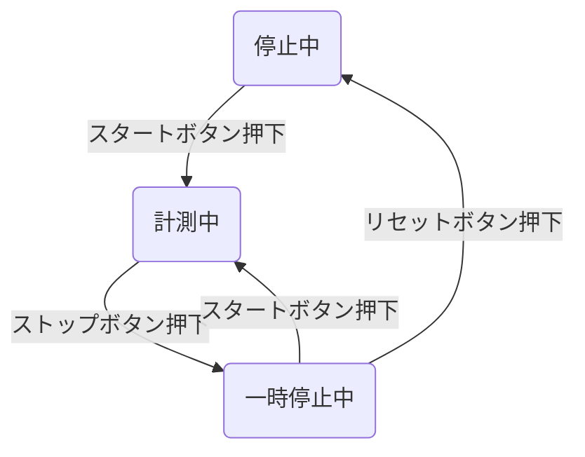

## はじめに

この記事では、**Windows10 上で Git bash で CLI で操作できる方法** をまとめております。
:::details 参考資料
@[card](https://gihyo.jp/magazine/SD/archive/2024/202402)
:::

## 1. ブラックボックステスト

> **ブラックボックステスト**: テスト対象をブラックボックスととらえて、その使用上の振る舞いを入出力に着目してテストケースを作成する技法

### 同値分割法

:::message

- **同値分割法**: テスト対象への入力を同等に処理されるグループに分けて、グループごとに任意の値をテストする技法
- **メリット**: 対象グループの 1 つの値をテストすれば十分なため、テスト数を削減できる

:::

> 例えば、「入力欄には 1 以上 100 以下の整数が入力できる」仕様があった場合 ⇒ **3 パターン**
>
> - 0 以下のグループ
> - 1 以上 100 以下のグループ
> - 101 以上のグループ

### 境界値分析

:::message

- **同値分割法**: テスト対象の仕様の中で「○○ 未満」「○○ 以上」など値に境界が存在する場合にその境界付近の値でテストする技法
- **メリット**: `>`や`>=`のイコールの有無の勘違いを検出することが可能

:::

> 例えば、「入力欄には 1 以上 100 以下の整数が入力できる」仕様があった場合 ⇒ **6 パターン**
>
> - 0 (最小値の境界値 - 1)
> - 1 (最小値の境界値)
> - 2 (最小値の境界値 + 1)
> - 99 (最大値の境界値 - 1)
> - 100 (最大値の境界値)
> - 101 (最大値の境界値 + 1)

### ディジョンテーブルテスト(組み込みパターン表)

:::message

- **同値分割法**: 入力条件の組み合わせと対応する出力結果を整理してテストケースを作成する技法
- **メリット**: テストパターンを可視化することができ、考慮漏れを防ぐことができる

:::

|      |                      | 1. 条件記述部 | 2. 動作記述部 | 3. 条件指定部 | 4. 動作指定部 |
| ---- | -------------------- | ------------- | ------------- | ------------- | ------------- |
| 条件 | タイムサービス時間内 | T             | T             | T             | F             |
|      | 割引対象商品         | T             | F             | F             | -             |
|      | 会員                 | -             | T             | F             | -             |
| 動作 | 10%割引              | X             | -             | -             | -             |
|      | 5%割引               | -             | X             | -             | -             |
|      | 割引なし             | -             | -             | X             | X             |

※「T」:TRUE/ 「F」: FALSE
※「-」はその条件が動作に影響しない

@[card](https://www.veriserve.co.jp/helloqualityworld/service/gihoz/)
ディジョンテーブルテストをもとにテストケースを作成すると、、、

| No  | 時間  | 商品 | 会員   | 期待結果                  |
| --- | ----- | ---- | ------ | ------------------------- |
| 1   | 19 時 | 衣類 | -      | 10 割引で商品で購入できる |
| 2   | 19 時 | 酒類 | 会員   | 5 割引で商品で購入できる  |
| 3   | 19 時 | 酒類 | 非会員 | 割引なしで購入できる      |
| 4   | 13 時 | -    | -      | 割引なしで購入できる      |

※ 例えば、「18-20 時がタイムサービス、酒類は割引対象害」仕様があった場合

### 状態遷移

|            | スタートボタン押下 | ストップボタン押下 | リセットボタン押下 |
| ---------- | ------------------ | ------------------ | ------------------ |
| 停止中     | 計測中             |                    |                    |
| 計測中     |                    | 一時停止中         |                    |
| 一時停止中 | 計測中             |                    | 停止中             |

#### 0 スイッチカバレッジ

| No. | 開始状態   | イベント           | 終了状態   |
| --- | ---------- | ------------------ | ---------- |
| 1   | 停止中     | スタートボタン押下 | 計測中     |
| 2   | 計測中     | ストップボタン押下 | 一時停止中 |
| 3   | 一時停止中 | スタートボタン押下 | 計測中     |
| 4   | 一時停止中 | リセットボタン押下 | 停止中     |

#### 1 スイッチカバレッジ

| No. | 開始状態   | イベント           | 中間状態   | イベント           | 終了状態   |
| --- | ---------- | ------------------ | ---------- | ------------------ | ---------- |
| 1   | 停止中     | スタートボタン押下 | 計測中     | ストップボタン押下 | 一時停止中 |
| 2   | 計測中     | ストップボタン押下 | 一時停止中 | スタートボタン押下 | 計測中     |
| 3   | 計測中     | ストップボタン押下 | 一時停止中 | リセットボタン押下 | 停止中     |
| 4   | 一時停止中 | スタートボタン押下 | 計測中     | ストップボタン押下 | 一時停止中 |
| 5   | 一時停止中 | リセットボタン押下 | 停止中     | スタートボタン押下 | 計測中     |
