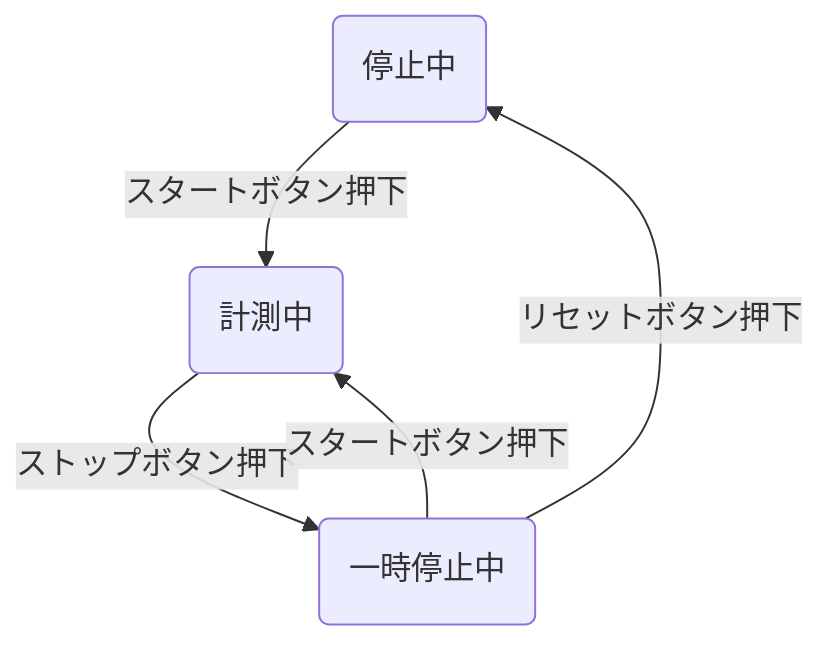

## 🌱 はじめに

この記事では、**ブラックボックステスト**と**ホワイトボックステスト**についてまとめています。
:::details 参考資料
@[card](https://gihyo.jp/magazine/SD/archive/2024/202402)
:::

## 🌱 1. ブラックボックステスト

> **ブラックボックステスト**: テスト対象をブラックボックスととらえて、その使用上の振る舞いを入出力に着目してテストケースを作成する技法

### 同値分割法

:::message

- **同値分割法**: テスト対象への入力を同等に処理されるグループに分けて、グループごとに任意の値をテストする技法
- **メリット**: 対象グループの 1 つの値をテストすれば十分なため、テスト数を削減できる

:::

> 例えば、「入力欄には 1 以上 100 以下の整数が入力できる」仕様があった場合 ⇒ **3 パターン**
>
> - 0 以下のグループ
> - 1 以上 100 以下のグループ
> - 101 以上のグループ

### 境界値分析

:::message

- **境界値分析**: テスト対象の仕様の中で「○○ 未満」「○○ 以上」など値に境界が存在する場合に、その境界付近の値でテストする技法
- **メリット**: `>`や`>=`のイコールの有無の勘違いを検出できる

:::

> 例えば、「入力欄には 1 以上 100 以下の整数が入力できる」仕様があった場合 ⇒ **6 パターン**
>
> - 0 (最小値の境界値 - 1)
> - 1 (最小値の境界値)
> - 2 (最小値の境界値 + 1)
> - 99 (最大値の境界値 - 1)
> - 100 (最大値の境界値)
> - 101 (最大値の境界値 + 1)

※ 上記は、境界の値とその前後の値を選ぶ方式です。境界の値とその外側の値だけを選ぶ場合は、0、1、100、101 の **4 パターン**になります。

### デシジョンテーブルテスト（決定表）

:::message

- **デシジョンテーブルテスト**: 入力条件の組み合わせと対応する出力結果を整理してテストケースを作成する技法
- **メリット**: テストパターンを可視化でき、考慮漏れを防げる

:::

例えば、「18〜20 時がタイムサービス、衣類は割引対象、酒類は割引対象外」という仕様があった場合、デシジョンテーブルは次のようになります。

|      |                      | ルール 1 | ルール 2 | ルール 3 | ルール 4 |
| ---- | -------------------- | -------- | -------- | -------- | -------- |
| 条件 | タイムサービス時間内 | T        | T        | T        | F        |
|      | 割引対象商品         | T        | F        | F        | -        |
|      | 会員                 | -        | T        | F        | -        |
| 動作 | 10%割引              | X        | -        | -        | -        |
|      | 5%割引               | -        | X        | -        | -        |
|      | 割引なし             | -        | -        | X        | X        |

※「T」: TRUE / 「F」: FALSE
※「-」はその条件が動作に影響しない

デシジョンテーブルは、次の 4 つの領域で構成されます。

- **条件記述部**（左上）: 条件の名前（タイムサービス時間内、割引対象商品、会員）
- **条件指定部**（右上）: ルールごとの条件の値（T / F / -）
- **動作記述部**（左下）: 動作の名前（10%割引、5%割引、割引なし）
- **動作指定部**（右下）: ルールごとに実行される動作（X / -）

@[card](https://www.veriserve.co.jp/helloqualityworld/service/gihoz/)

デシジョンテーブルをもとにテストケースを作成すると、次のようになります。

| No  | 時間  | 商品 | 会員   | 期待結果                   |
| --- | ----- | ---- | ------ | -------------------------- |
| 1   | 19 時 | 衣類 | -      | 10%割引で商品を購入できる  |
| 2   | 19 時 | 酒類 | 会員   | 5%割引で商品を購入できる   |
| 3   | 19 時 | 酒類 | 非会員 | 割引なしで購入できる       |
| 4   | 13 時 | -    | -      | 割引なしで購入できる       |

### 状態遷移テスト


```mermaid
graph TB
    A(停止中) -->|スタートボタン押下| B(計測中)
    B -->|ストップボタン押下| C(一時停止中)
    C -->|リセットボタン押下| A
    C -->|スタートボタン押下| B
```

|            | スタートボタン押下 | ストップボタン押下 | リセットボタン押下 |
| ---------- | ------------------ | ------------------ | ------------------ |
| 停止中     | 計測中             | -                  | -                  |
| 計測中     | -                  | 一時停止中         | -                  |
| 一時停止中 | 計測中             | -                  | 停止中             |

※「-」は、そのイベントが発生しても状態が変わらない（遷移しない）ことを表します。

#### 0 スイッチカバレッジ

個々の遷移を 1 回ずつ網羅します。

| No. | 開始状態   | イベント           | 終了状態   |
| --- | ---------- | ------------------ | ---------- |
| 1   | 停止中     | スタートボタン押下 | 計測中     |
| 2   | 計測中     | ストップボタン押下 | 一時停止中 |
| 3   | 一時停止中 | スタートボタン押下 | 計測中     |
| 4   | 一時停止中 | リセットボタン押下 | 停止中     |

#### 1 スイッチカバレッジ

連続する 2 つの遷移の組み合わせを網羅します。

| No. | 開始状態   | イベント           | 中間状態   | イベント           | 終了状態   |
| --- | ---------- | ------------------ | ---------- | ------------------ | ---------- |
| 1   | 停止中     | スタートボタン押下 | 計測中     | ストップボタン押下 | 一時停止中 |
| 2   | 計測中     | ストップボタン押下 | 一時停止中 | スタートボタン押下 | 計測中     |
| 3   | 計測中     | ストップボタン押下 | 一時停止中 | リセットボタン押下 | 停止中     |
| 4   | 一時停止中 | スタートボタン押下 | 計測中     | ストップボタン押下 | 一時停止中 |
| 5   | 一時停止中 | リセットボタン押下 | 停止中     | スタートボタン押下 | 計測中     |

## 🌱 2. ホワイトボックステスト

> **ホワイトボックステスト**: テスト対象の内部構造（ソースコード）に着目してテストケースを作成する技法

どれだけコードを実行できたかは、網羅率（カバレッジ）で測ります。代表的なものは次の 2 つです。

- **命令網羅（ステートメントカバレッジ）**: すべての命令を 1 回以上実行する
- **分岐網羅（ブランチカバレッジ）**: すべての分岐の真と偽を 1 回以上実行する

例えば、次のコードの場合は、`value`に`-5`を入れるだけで、すべての命令を通るため命令網羅は 100%になります。しかし、`if`の条件が偽になる経路は通っていないため、分岐網羅は 50%です。

```ts
const toPositive = (value: number): number => {
  let result = value;
  if (value < 0) {
    result = -value;
  }
  return result;
};
```

分岐網羅を 100%にするには、`5`のように条件が偽になる値もテストします。
