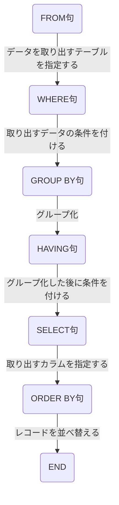

## 記号の種類

| 記号 | 意味                 |
| ---- | -------------------- |
| =    | 左辺と右辺が同じ     |
| <    | 左辺が右辺より小さい |
| >    | 左辺が右辺より大きい |
| <=   | 左辺が右辺以下       |
| >=   | 左辺が右辺以上       |
| <>   | 左辺と右辺が異なる   |

## 条件式の優先順位

| 優先順位 | 記号         |
| -------- | ------------ |
| 高       | <, >, <=, >= |
|          | =, <>        |
|          | NOT          |
|          | AND          |
| 低       | OR           |

## SQL実行順番

