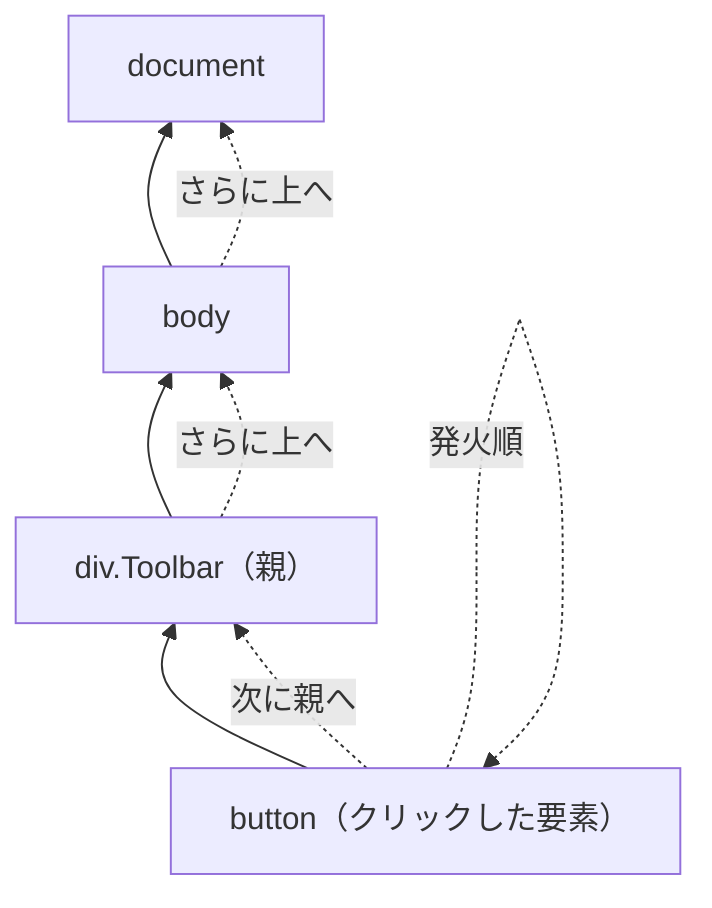
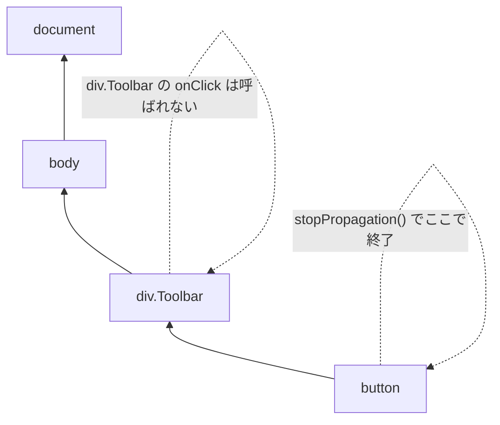

## 🌱 イベント伝播（バブリング）
下記コードの`ボタンA`または`ボタンB`をクリックすると、次の順番でアラートが表示されます。
- `ボタンAが押されたよ!` -> `親の<div>が反応するよ`
- `ボタンBが押されたよ!` -> `親の<div>が反応するよ`

:::message
**ポイント**
クリックした要素（button）の`onClick`が先に実行され、
そのあと 親要素へイベントが伝わり（バブリング）、親の`<div>`の`onClick`が実行されます。
:::



```tsx
export default function Toolbar() {
  return (
    <div className="Toolbar" onClick={() => {
      alert('親の<div>が反応するよ');
    }}>
      <button onClick={() => alert('ボタンAが押されたよ!')}>
        ボタンA
      </button>
      <button onClick={() => alert('ボタンBが押されたよ!')}>
        ボタンA
      </button>
    </div>
  );
}

```

## 🌱 伝播（バブリング）を止める
親コンポーネントにイベントを伝えたくない場合は、クリックハンドラ内で`e.stopPropagation()`を呼び出します。
ここでの`e`は イベントオブジェクトで、クリックに関する情報を持っています（引数名は`e`でも`event`でもOKです）。

以下のように`Button`コンポーネント側で`stopPropagation()`を呼ぶと、親の`<div>`の`onClick`は実行されません。



```diff tsx
+ function Button({ onClick, children }) {
+   return (
+     <button onClick={e => {
+       e.stopPropagation();
+       onClick();
+     }}>
+       {children}
+     </button>
+   );
+ }

export default function Toolbar() {
  return (
    <div className="Toolbar" onClick={() => {
      alert('親の<div>が反応するよ');
    }}>
-      <button onClick={() => alert('ボタンAが押されたよ!')}>
+      <Button onClick={() => alert('ボタンAが押されたよ!')}>
        ボタンA
-      </button>
-      <button onClick={() => alert('ボタンBが押されたよ!')}>
+      <Button onClick={() => alert('ボタンBが押されたよ!')}>
        ボタンB
-      </button>
+      </Button>
    </div>
  );
}

```

:::message
**ポイント（実行の流れ）**
1. `React`がクリックされた`<button>`の`onClick`を呼ぶ
2. `Button`内のハンドラが動き、`e.stopPropagation()`でバブリングを止める
3. 続けて`Toolbar`から渡された`onClick`を呼び出し、ボタン固有のアラートを表示する
4. 伝播が止まっているので、親の`<div>`の`onClick`は実行されない
:::


## 🌱 伝播のデメリット

子の`<button>`をクリックした -> 自動で親の`onClick`まで発火する
一見便利そうだが....

:::message
**ポイント**
- 親が意図せず反応してしまう（子は“自分だけ”反応してほしいのに、親の処理も走る）
- あとから親に`onClick`を足したら、子のクリック挙動が変わる（影響範囲が広がる）
- どのクリックがどの処理を動かしているか追跡しづらい（バグ調査で「なんで親が動いた？」になりやすい）

= `stopPropagation()`は`“その場しのぎ”`になりやすい
:::

## 🌱 デフォルト動作を防ぐ（preventDefault）

`<form>`の`submit`は、送信ボタンが押されるとデフォルトでページ遷移（リロード）を伴うことがあります。
（SPA ではこれが邪魔になることが多いです）

```jsx
export default function Signup() {
  return (
    <form onSubmit={() => alert('Submitting!')}>
      <input />
      <button>Send</button>
    </form>
  );
}

```

イベントオブジェクトの`e.preventDefault()`を呼び出して、これを防ぐことができます。
```diff jsx
export default function Signup() {
  return (
-    <form onSubmit={() => alert('Submitting!')}>
+    <form onSubmit={e => {
+      e.preventDefault();
+      alert('Submitting!');
+    }}>
      <input />
      <button>Send</button>
    </form>
  );
}

```

:::message
**ポイント**
- `e.stopPropagation()`: ツリーの上側にあるタグにアタッチされたイベントハンドラが発火しないようにします。
- `e.preventDefault()`: 数は少ないですがイベントがブラウザデフォルトの動作を持っていた場合に、それを抑制します。
:::